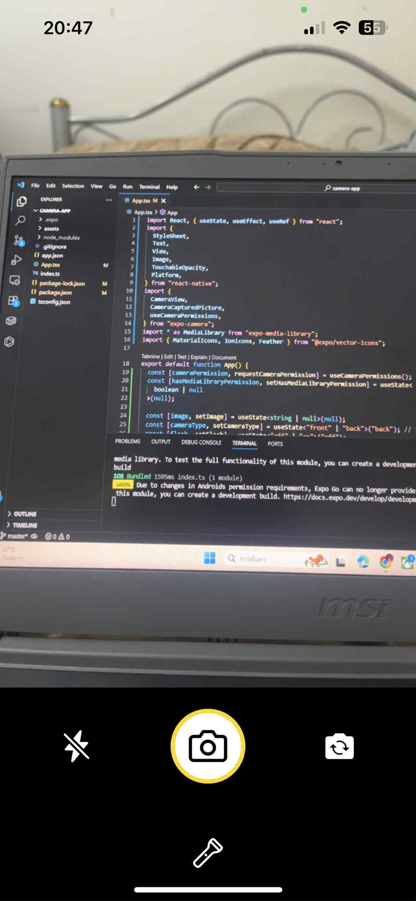
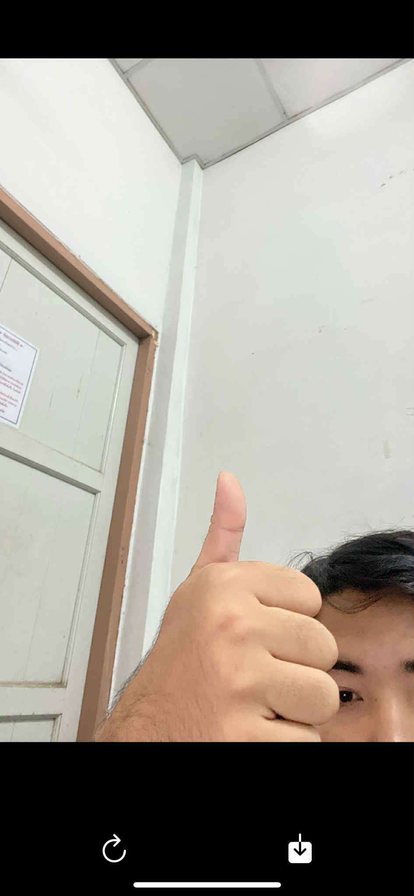
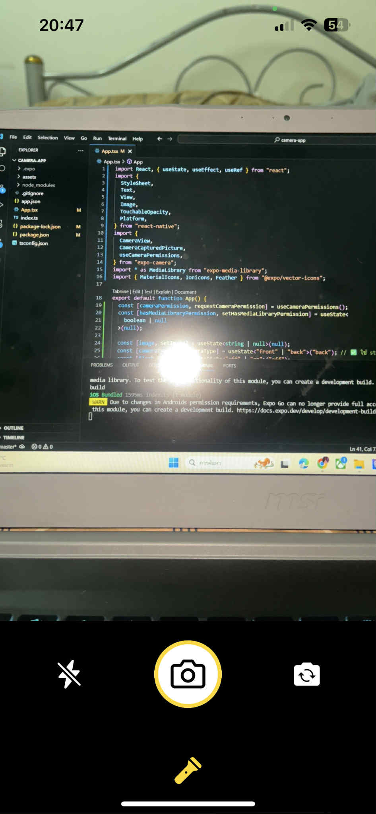
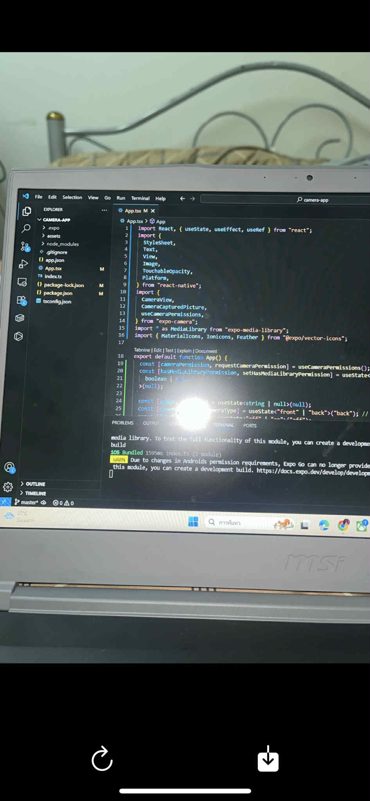
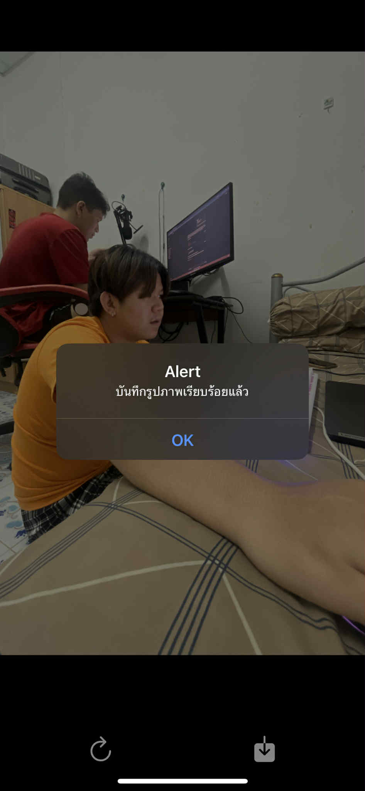

# Camera App

แอปถ่ายรูปด้วยกล้องมือถือ สลับกล้องหน้า-หลัง เปิด/ปิดแฟลช เปิด/ปิดไฟฉาย และบันทึกรูปลงคลังภาพ (เฉพาะ iOS Development Build)

## รายละเอียดโปรแกรม

- ขอสิทธิ์เข้าถึงกล้องและคลังรูปภาพ
- แสดงกล้องถ่ายรูป สามารถสลับกล้องหน้า/หลัง
- เปิด/ปิดแฟลช และไฟฉายได้
- ถ่ายรูปและแสดงตัวอย่างก่อนบันทึก
- บันทึกรูปลงคลังภาพ (iOS Development Build เท่านั้น, Expo Go บน Android ยังไม่รองรับ)

## การติดตั้ง

1. ติดตั้ง [Node.js](https://nodejs.org/) และ [Expo CLI](https://docs.expo.dev/get-started/installation/)
2. โคลนโปรเจกต์นี้และติดตั้ง dependencies

   ```sh
   git clone <repo-url>
   cd camera-app
   ```
    ```sh
    npx expo install expo-camera expo-media-library
   ```

3. รันแอป

   ```sh
   npx expo start
   ```

4. สแกน QR code และเปิดแอป Expo Go 

## การทำงาน

- เปิดแอปครั้งแรก ระบบจะขอสิทธิ์เข้าถึงกล้องและคลังรูปภาพ
- กดปุ่มกล้องเพื่อถ่ายรูป
- กดปุ่ม "refresh" เพื่อถ่ายใหม่ หรือ "download" เพื่อบันทึกรูป (เฉพาะ iOS Development Build)
- สลับกล้องหน้า/หลัง, เปิด/ปิดแฟลช และไฟฉายได้

# Camera App

แอปถ่ายรูปด้วยกล้องมือถือ สลับกล้องหน้า-หลัง เปิด/ปิดแฟลช เปิด/ปิดไฟฉาย และบันทึกรูปลงคลังภาพ (เฉพาะ iOS Development Build)

## รายละเอียดโปรแกรม

- ขอสิทธิ์เข้าถึงกล้องและคลังรูปภาพ
- แสดงกล้องถ่ายรูป สามารถสลับกล้องหน้า/หลัง
- เปิด/ปิดแฟลช และไฟฉายได้
- ถ่ายรูปและแสดงตัวอย่างก่อนบันทึก
- บันทึกรูปลงคลังภาพ (iOS Development Build เท่านั้น, Expo Go บน Android ยังไม่รองรับ)

## การติดตั้ง

1. ติดตั้ง [Node.js](https://nodejs.org/) และ [Expo CLI](https://docs.expo.dev/get-started/installation/)
2. โคลนโปรเจกต์นี้และติดตั้ง dependencies

   ```sh
   git clone <repo-url>
   cd camera-app
   ```
    ```sh
    npx expo install expo-camera expo-media-library
   ```

3. รันแอป

   ```sh
   npx expo start
   ```

4. สแกน QR code และเปิดแอป Expo Go 

## การทำงาน

- เปิดแอปครั้งแรก ระบบจะขอสิทธิ์เข้าถึงกล้องและคลังรูปภาพ
- กดปุ่มกล้องเพื่อถ่ายรูป
- กดปุ่ม "refresh" เพื่อถ่ายใหม่ หรือ "download" เพื่อบันทึกรูป (เฉพาะ iOS Development Build)
- สลับกล้องหน้า/หลัง, เปิด/ปิดแฟลช และไฟฉายได้







## หมายเหตุ

- Expo Go บน Android ยังไม่สามารถบันทึกรูปลงคลังภาพได้ ต้องสร้าง Development Build ([ดูวิธีที่นี่](https://docs.expo.dev/development/introduction/))
- ไฟล์ assets เช่น icon, splash, adaptive icon อยู่ในโฟลเดอร์ `assets/`


## หมายเหตุ

- Expo Go บน Android ยังไม่สามารถบันทึกรูปลงคลังภาพได้ ต้องสร้าง Development Build ([ดูวิธีที่นี่](https://docs.expo.dev/development/introduction/))
- ไฟล์ assets เช่น icon, splash, adaptive icon อยู่ในโฟลเดอร์ `assets/`

